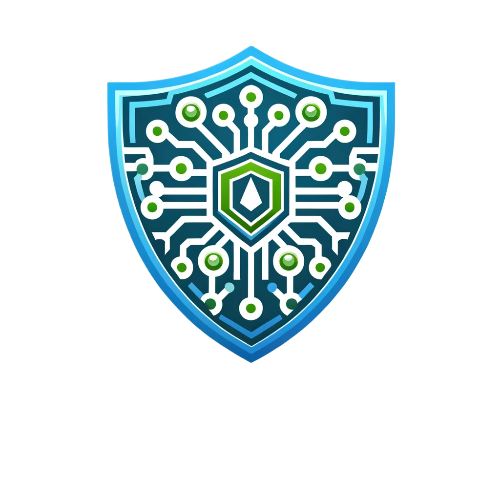
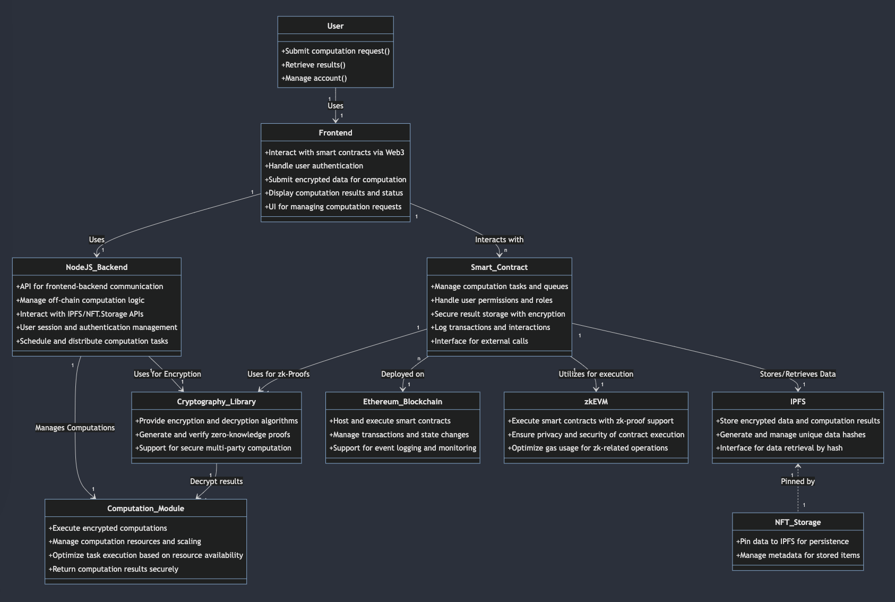
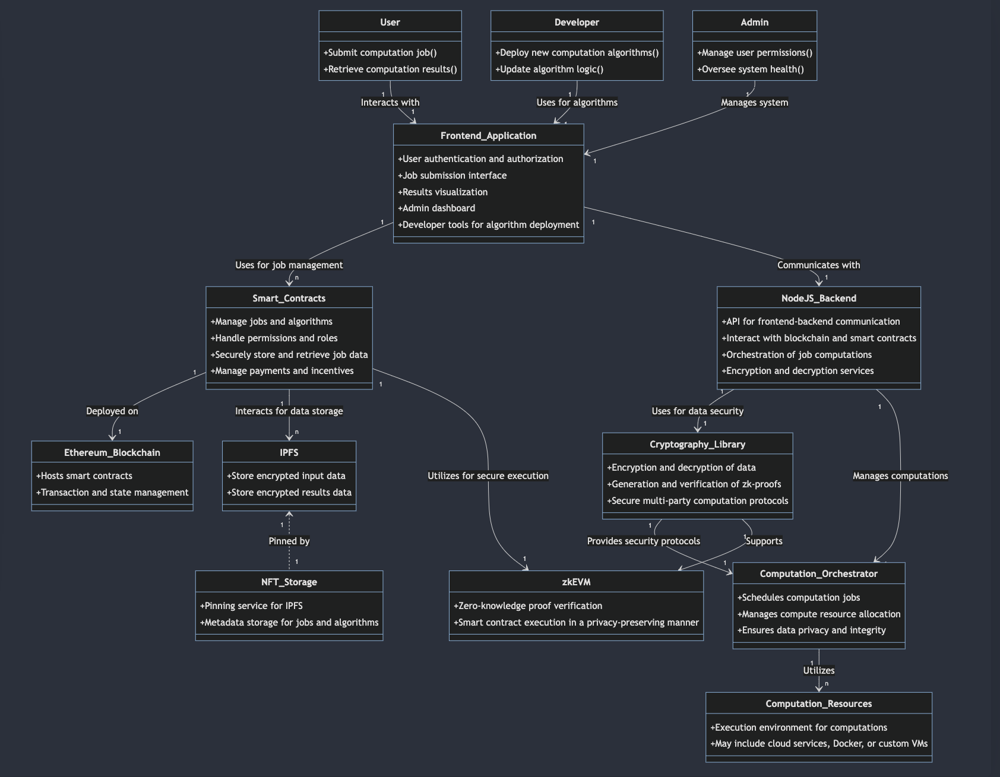
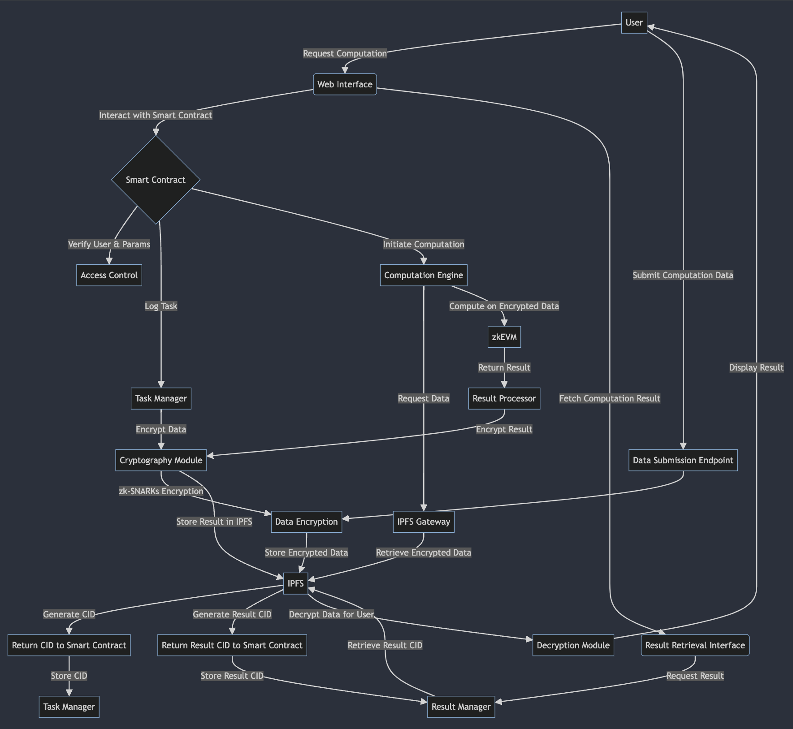
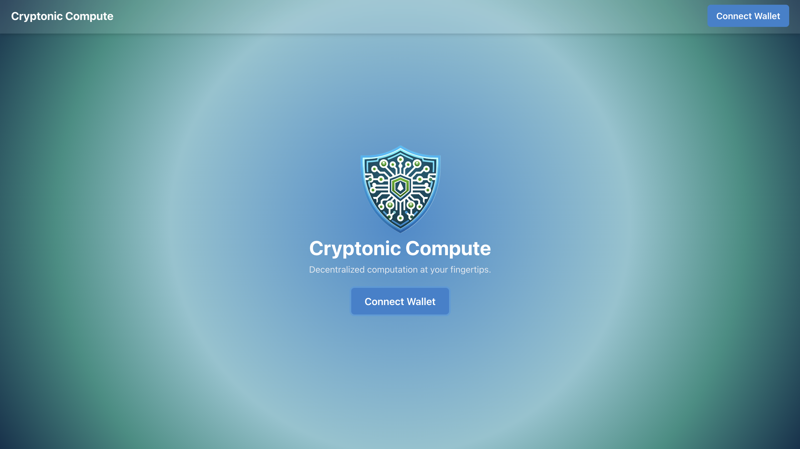
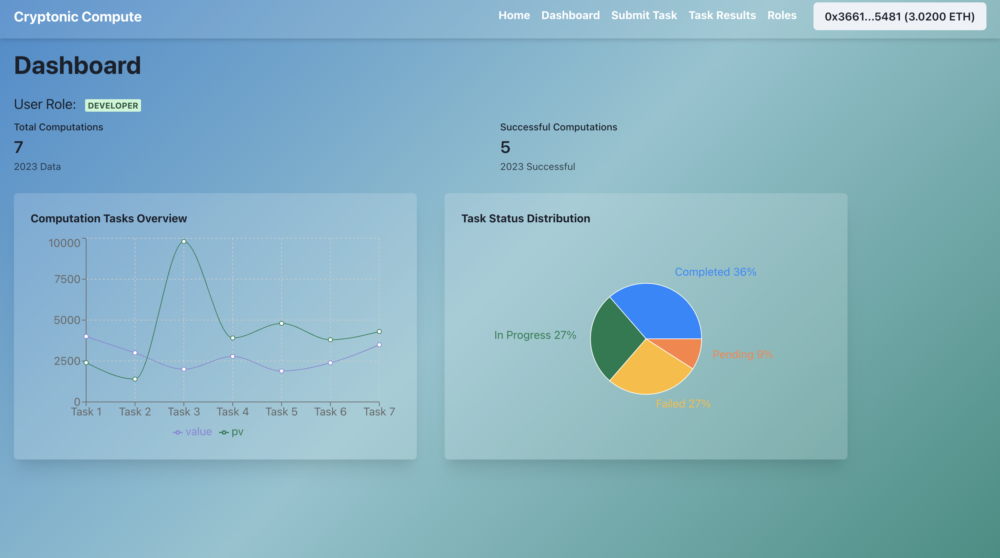
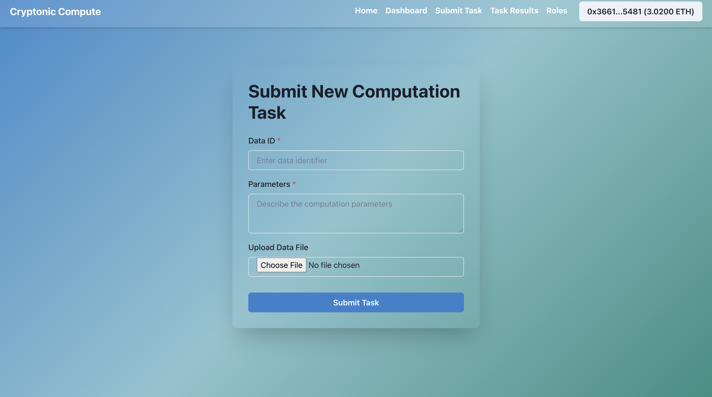
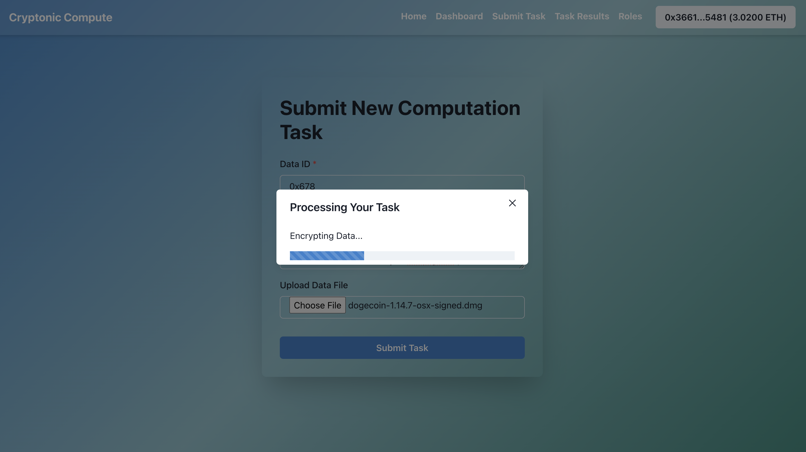
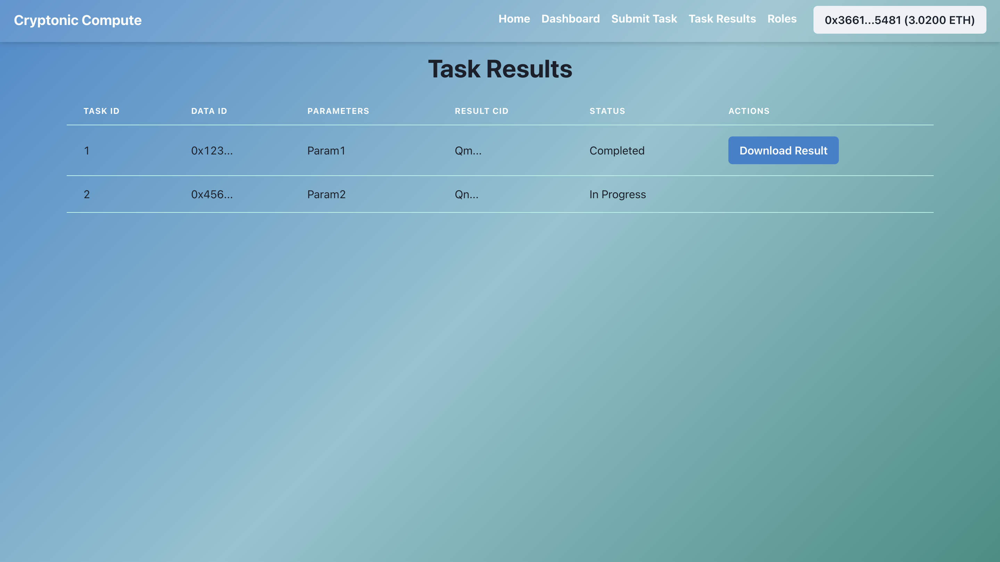
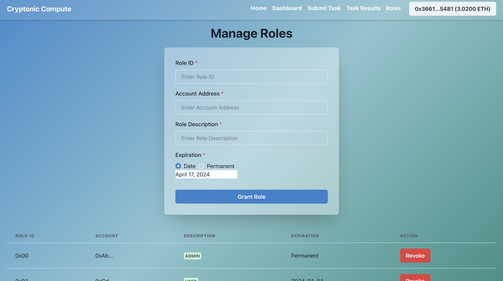

# Cryptonic Compute

  

## Introduction

Cryptonic Compute is a groundbreaking decentralized platform designed to execute computation over data in a secure and privacy-preserving manner. It utilizes advanced artificial intelligence algorithms to perform complex computations on encrypted data. By leveraging the power of blockchain technology, zkEVM for zero-knowledge proofs, and IPFS for decentralized storage, Cryptonic Compute introduces a novel approach to processing data while preserving privacy, fostering a trustworthy digital environment for sensitive operations.

## Why Cryptonic Compute?

### Problem Use Case

In the modern digital landscape, ensuring data privacy and security is paramount across various industries. Healthcare, finance, and personal services require robust solutions to handle sensitive data without compromising privacy. Traditional cloud computing platforms present risks of data breaches and lack the necessary transparency, leading to concerns over data integrity and manipulation.

### Solution

Cryptonic Compute addresses these challenges by providing secure, transparent, and decentralized computing capabilities over encrypted data. The platform ensures that data remains encrypted during computation, accessible only to authorized entities. Integrating zkEVM, we utilize zero-knowledge proofs to perform computations, safeguarding data privacy and integrity without revealing the data itself.

## How It Works - Project Flow

The workflow of Cryptonic Compute is designed to ensure maximum security and efficiency:

1. **Data Submission**: Users encrypt and submit their data to the platform via a web interface.
2. **Smart Contract Interaction**: A smart contract logs the computation task and manages permissions.
3. **zk-SNARKs Encryption**: Data is encrypted using zero-knowledge proofs, ensuring that it remains confidential throughout the process.
4. **Computation Execution**: Encrypted data is processed using zkEVM compatible with Ethereum, guaranteeing the integrity of the computation.
5. **Result Encryption and Storage**: The computation result is encrypted and stored on IPFS, with access controlled by smart contracts.
6. **Result Retrieval**: Finally, users access their computation results through the web interface, with the assurance that their data confidentiality remains uncompromised.

## Strong Use Case

A prime use case for Cryptonic Compute is in the healthcare industry, where patient data privacy is crucial. Medical researchers can analyze encrypted patient data to identify trends, develop treatments, and improve patient outcomes without ever accessing personal health information directly. This capability ensures compliance with privacy laws and regulations while fostering innovation in medical research.

## Expansive Use Cases

Cryptonic Compute is not just a limited to healthcare projects but it's a versatile tool to address as such critical needs across multiple sectors:

- **Finance**: Secure multi-party computation enables collaborative financial analysis and fraud detection among institutions without revealing sensitive data.

- **Public Administration**: Private and secure computation of citizen data for policy making, urban planning, and public welfare programs.

- **Academic Research**: Facilitates collaborative research across institutions on sensitive data, ensuring data privacy and integrity.

- **Supply Chain Management**: Secure, transparent, and efficient logistics optimization and counterfeit detection without exposing proprietary or sensitive business data.

## UML or Flow Chart Diagram

  
   
  <i>UML Class Diagram for single User</i>

 

  
   
  <i>UML Class Diagram for Multiple Users</i>

 

  
   
  <i>Detailed Flow Diagram</i>

## Tech Stack

- **Blockchain**: Ethereum with zkEVM for executing zero-knowledge proofs
- **Smart Contracts**: Solidity
- **Frontend**: Next.js with Chakra UI
- **Cryptography**: zero-knowledge proof library such as zk-snark
- **Data Storage**: IPFS with pinata as the pinning service
- **Backend**: Node.js for server-side logic, managing computation logic and user interactions

## DEMO

  
   
  <i>Home Page</i>

 

  
   
  <i>Dashboard Page</i>

 

  
   
  <i>Submit Task Page</i>

 

  
   
  <i>Submission Processing</i>

 

  
   
  <i>Tasks Results</i>

 

  
   
  <i>Roles registration</i>

## Features

### Completed Features

- [x] Frontend with simple & interactive UI
- [x] Smart contract development & testing
- [x] Smart contract deployment on Polygon zkEVM
- [x] Smart contract integration with Frontend
- [x] Real-time tasks submissions and role minting over the blockchain

### Features In Progress

- [ ] Decentralized data storage on IPFS  
  - IPFS integration is partially implemented but requires additional testing and validation.
- [ ] Zero-knowledge proofs to ensure data privacy  
  - Initial groundwork laid out, but full integration with computations is pending.
- [ ] IPC subnet setup and deploying the project over it.

### Planned Features

- [ ] Support for multi-party computations  
  - Planning phase; to explore potential libraries and frameworks.
- [ ] Expansion to other blockchains for increased interoperability  
  - Future consideration for supporting other networks like Polkadot, Binance Smart Chain, etc.
- [ ] Web2 login for non-crypto users  
  - Intend to implement OAuth to bridge the gap between Web2 and Web3 functionalities.

## Note

The project has laid significant groundwork in establishing a user-friendly interface and the backend integration with Polygon zkEVM blockchain. However, there are several critical bugs and components like IPFS storage, IPC subnet setup and zero-knowledge proofs that are still under development. The next phases of the project will focus on solidifying these features, enhancing security measures, and ensuring that the system can operate seamlessly in a fully decentralized environment.

